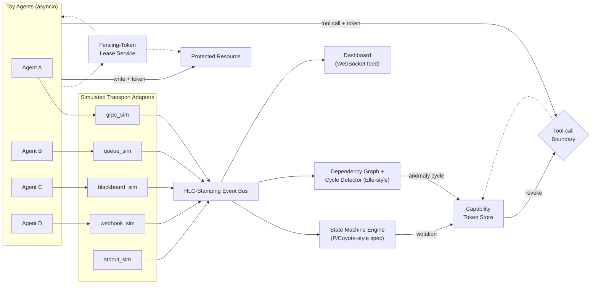

# ARBITER — A Causal Runtime Verifier for Multi-Agent AI Systems

> *ARBITER is a seatbelt for multi-agent systems — it can't stop an agent from thinking something wrong, but it structurally stops it from acting on a stale or duplicated decision.*

## What It Does

Multi-agent AI systems fail in ways single-agent systems don't: two agents grab the same task, a handoff acknowledgment never arrives, one agent silently duplicates work another already finished. These are **coordination bugs**, and they hide across whatever transport each agent happens to use.

ARBITER is a runtime verifier that:

1. **Watches** agent coordination events across multiple transports and stamps each with a *causal* timestamp
2. **Specifies** the coordination protocol as an explicit state machine with safety and liveness properties
3. **Prevents** hard-invariant violations structurally, before they touch a real resource
4. **Detects** soft-invariant anomalies that were never explicitly specified
5. **Revokes** a misbehaving agent's capability token the instant a violation is confirmed

## Architecture



## Quick Start

```bash
# Install dependencies
pip install -r requirements.txt

# Run the full three-act demo (with dashboard)
python scripts/run_demo.py

# Run headless (no server, for CI)
python scripts/run_demo.py --headless

# Run all tests
pytest tests/ -v
```

The dashboard opens automatically at **http://127.0.0.1:8000** and shows:
- Live event feed with transport labels and HLC timestamps
- Per-resource state-machine status with visual state flow
- D3.js dependency graph with WW/WR/RW edge visualization
- Violations & revocations panel with real-time alerts

## The Three-Act Demo

### Act 1 — Happy Path (Baseline)
Four toy agents across 4+ transports run a normal task handoff: Agent A claims `task-42` (fencing token 1), does the work, requests handoff, Agent B acknowledges. **Expected:** clean Idle→Claimed→InProgress→AwaitingAck→Acked; zero violations; zero cycles.

### Act 2 — Hard Invariant: Fencing Token Rejects Stale Write
Agent A acquires the lease (token N), then hangs. The lease expires (event-count TTL). Agent B acquires a fresh lease (token N+1), completes work, writes to the protected resource. Agent A "wakes up" and attempts its write with stale token N. **Expected:** the protected resource **structurally rejects** Agent A's write — not logged, REJECTED.

### Act 3 — Soft Invariant: Elle-Style Cycle Catches Write-Skew
Two agents each read `task-42`'s status from the shared blackboard at nearly the same causal moment and each independently claim it. Neither agent violates the spec on its own. **Expected:** the dependency-graph cycle detector finds a cycle (mutual RW anti-dependencies), both agents' capability tokens are revoked, and their next tool calls are rejected at the boundary.

## Theoretical Foundations

Each technique below is real, citable, and implemented in this system:

- **"We treat this as global predicate detection, not log scanning"** — Cooper & Marzullo's Possibly/Definitely framing (1991), scoped to the two classes known to be efficiently detectable: conjunctive and stable predicates. The general problem is NP-complete; we scoped around it instead of pretending to solve it.

- **"Every event carries a Hybrid Logical Clock timestamp"** — the same causal-ordering scheme CockroachDB and MongoDB use (Demirbas et al., 2014) — so we get a correct global ordering even though our transports never share a clock.

- **"Hard invariants are enforced with fencing tokens"** — Kleppmann's fix (2016) for the 'paused process wakes up and clobbers state' race: a stale agent's write is structurally rejected, not just logged after the fact.

- **"Soft invariants are caught the way Jepsen's Elle checker catches database isolation bugs"** — build a dependency graph from claim/read/write operations and look for cycles (Kingsbury & Alvaro, VLDB 2020). A cycle proves no valid ordering could explain what we observed.

- **"The spec layer borrows the idea behind Microsoft's P language and Coyote"** — used to verify Windows' USB driver stack and Azure services: model the protocol as a state machine with explicit safety/liveness properties instead of ad hoc checker code.

- **"The kill switch is capability revocation"** — not trying to interrupt an LLM mid-generation (you can't cleanly do the latter), so we gate the agent's next tool call instead.

## Testing

```bash
# Run all tests
pytest tests/ -v

# Run specific test suites
pytest tests/test_hlc.py -v          # HLC monotonicity, merge, clock skew
pytest tests/test_fencing.py -v      # Fencing tokens, stale rejection, TTL
pytest tests/test_state_machine.py -v # State machine transitions, violations
pytest tests/test_cycle_detector.py -v # Dependency graph, cycle detection
pytest tests/test_demo_e2e.py -v     # Full three-act demo end-to-end
```

## Scoping Decisions

Each of these is a **deliberate scoping decision**, not a gap — reframed as "how we'd scale this":

| Decision | Rationale | How We'd Scale |
|---|---|---|
| **Simulated transports** (not real eBPF capture) | Instrument toy agents directly via `bus.emit()` | Swap to Cilium Tetragon / Pixie-style socket capture for agent-code-agnostic operation |
| **In-memory `LeaseBackend`** (not distributed) | Single-process demo behind the `LeaseBackend` protocol | Swap in etcd/Raft/Chubby — implementation change, not a redesign |
| **Hand-rolled DSL** (not full LTL parser) | Same "spec, not ad hoc checker" story at 1/10th build time | Extend to a full temporal logic parser/compiler |
| **OTel-shaped schemas** (not real OTel SDK) | Schema is a compatible superset of OTel spans | Wire real Collector — one-line integration |
| **Passthrough `LocalChecker`** (not decomposed) | Interface boundary exists for predicate slicing | Deploy edge checkers per agent-pair, send digests to central verifier |
| **In-memory storage** (no persistence) | Everything lives in process memory for the run | Add a time-series DB for event storage |
| **Event-count TTL** (not wall-clock) | Deterministic, testable — no timing flakiness in demos | Use wall-clock + watchdog in production |
| **Per-resource event counters** (not global) | A chatty resource shouldn't starve a quiet resource's timeout budget | Same approach at scale |
| **Blackboard reads as `tool_call`** with `op="read"` | Keeps Event.kind enum closed per Section 6.1 | Same approach |
| **Safety property per-resource** | "One owning agent per resource_id" — not system-wide | Same approach at scale |

## Project Structure

```
arbiter/
  README.md                           # This file
  IMPLEMENTATION_PLAN.md              # Phase-by-phase build plan
  pyproject.toml                      # Project config & dependencies
  requirements.txt                    # Pip requirements
  src/
    verifier/
      hlc.py                          # Hybrid Logical Clock
      events.py                       # Event, HLCTimestamp schemas
      bus.py                          # In-memory pub/sub event bus
      verifier_service.py             # FastAPI app + WebSocket
      transports/
        grpc_sim.py                   # Simulated gRPC transport
        queue_sim.py                  # Simulated NATS/Kafka queue
        blackboard_sim.py             # Simulated shared KV store
        webhook_sim.py                # Simulated webhook transport
        stdout_sim.py                 # Simulated stdout transport
      lease/
        fencing.py                    # FencingLease, LeaseBackend protocol
        lease_manager.py              # LeaseManager implementation
        protected_resource.py         # WriteResult, protocol
        protected_resource_impl.py    # Fencing-token enforcement
      spec/
        state_machine.py              # Engine contracts & MachineInstance
        state_machine_engine.py       # P/Coyote-style engine impl
        task_ownership_spec.py        # The demo invariant spec
      anomaly/
        dependency_graph.py           # Cycle, EdgeType contracts
        dependency_graph_impl.py      # Elle-style DSG builder
        cycle_detector.py             # (integrated into graph_impl)
      capability/
        tokens.py                     # CapabilityToken contracts
        capability_store.py           # Token store implementation
        tool_boundary.py              # Circuit breaker
      decompose/
        local_checker.py              # Predicate-slicing boundary
    agents/
      base_agent.py                   # Base agent class
      toy_agents.py                   # Scripted demo agents
    dashboard/
      index.html                      # Dashboard UI
      app.js                          # WebSocket client + D3.js
      styles.css                      # Dark theme + glassmorphism
  tests/
    test_hlc.py                       # HLC unit tests
    test_fencing.py                   # Fencing token tests
    test_state_machine.py             # State machine tests
    test_cycle_detector.py            # Cycle detection tests
    test_demo_e2e.py                  # Full three-act e2e test
    test_placeholder.py               # Schema import tests
  scripts/
    run_demo.py                       # Three-act demo orchestrator
```

## Glossary

| Term | One-liner | Source |
|---|---|---|
| HLC | Hybrid Logical Clock — physical + logical timestamp pair | Demirbas, Leone, Avva, Madeppa & Kulkarni, 2014 |
| Fencing token | Monotonically increasing token that invalidates stale writes | Kleppmann, 2016 |
| Elle | Cycle-based, black-box transactional-isolation checker | Kingsbury & Alvaro, VLDB 2020 |
| DSG | Direct Serialization Graph — WW/WR/RW dependency formalism | Adya, Liskov & O'Neil |
| P / Coyote | State-machine spec language + production successor | Microsoft Research |
| Possibly / Definitely | The two global-predicate-detection modalities | Cooper & Marzullo, 1991 |
| Conjunctive predicate | AND of local per-process conditions — polynomial-time detectable | Garg & Waldecker |
| Stable predicate | Once true, always true (e.g. task complete) | Chandy & Lamport, 1985 |
| Predicate slicing | Decomposing a global predicate into implying local predicates | Garg & Mittal, 2001 |
