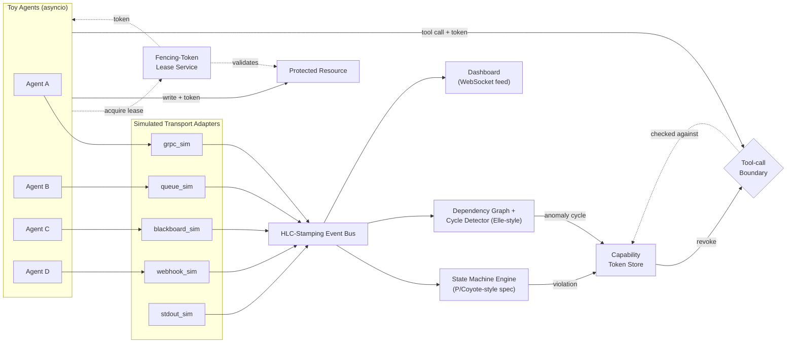

# ARBITER — A Causal Runtime Verifier for Multi-Agent AI Systems
### AI Build Prompt (hackathon-scoped, theory-grounded)

> **Note to the human running this:** everything from Section 1 onward is written as one self-contained brief for an AI coding agent. Paste it whole into Claude Code, Cursor, or a fresh chat with code execution enabled, and let it work phase by phase — it doesn't need any context beyond this file. "ARBITER" is a working name; rename freely, nothing depends on it. The default stack (Section 5) is Python 3.11 + FastAPI — swap it if your team prefers something else, since the contracts in Section 6 are language-agnostic. Every technique named below is a real, citable piece of systems literature, so the pitch holds up if a judge pushes back on any one piece.

---

## 1. Role & Operating Rules

<role>
You are a senior distributed-systems engineer who also knows the runtime-verification literature well enough to implement a scoped-down version of it in a weekend. You're building this for a hackathon: the system must run end-to-end, demo cleanly, and survive a technical judge asking "how does that actually work?" — but it does not need to be production-hardened, horizontally scaled, or fault-tolerant beyond what's specified below.
</role>

<operating_rules>
1. Before writing any code, create `IMPLEMENTATION_PLAN.md`: restate the phases in Section 7 in your own words, list every file you intend to create, and flag any assumption you're making. Then start Phase 0.
2. Work through Section 7's phases **in order**. Don't start a phase until the previous phase's Definition of Done is fully met.
3. After each phase: run that phase's tests, show the pass/fail output, and give a 3–5 line status update (what got built, what got simplified, what's next). Then continue to the next phase without waiting to be told — unless a Definition-of-Done item genuinely cannot be met, in which case say so and propose the smallest fix before moving on.
4. If something in this brief is ambiguous or underspecified, make the smallest reasonable simplification that still demonstrates the underlying invariant, log one line about it under a "Scoping Decisions" heading in `README.md`, and keep going. This is a solo hackathon build — there's no one to ask, so don't stall.
5. Write readable, docstring-commented code over clever/compressed code, and name the technique being implemented in the comment (e.g. `# fencing-token check — Kleppmann, "How to do distributed locking," 2016`). Judges and teammates will read this.
6. Everything in Section 9 ("Non-Goals") is intentionally out of scope. Don't build it and don't apologize for skipping it — just note it as a deliberate scoping decision where the template says to.
7. Write tests as you go, not at the end. Section 10 sets the bar per component.
8. The stack in Section 5 is fixed to remove decision paralysis. If you have a strong reason to deviate, note it in `IMPLEMENTATION_PLAN.md` and proceed — don't stop to ask permission.
</operating_rules>

---

## 2. Mission Brief

Multi-agent AI systems fail in ways single-agent systems don't: two agents grab the same task, a handoff acknowledgment never arrives, one agent silently duplicates work another already finished. These are coordination bugs, and they hide across whatever transport each agent happens to use — gRPC, a Kafka/NATS queue, a shared Postgres/Redis blackboard, a webhook, or just stdout piped into a CLI orchestrator. A verifier that only watches gRPC traffic is blind to the other four.

**ARBITER** is a runtime verifier that:

1. **Watches** agent coordination events across multiple transports and stamps each one with a *causal*, not wall-clock, timestamp — so events from agents that share no clock can still be ordered correctly.
2. **Specifies** the coordination protocol as an explicit state machine with safety and liveness properties, instead of hand-written if/else checker code.
3. **Prevents** hard-invariant violations structurally, before they touch a real resource — not just logging them after the fact.
4. **Detects** soft-invariant anomalies (duplicate work, coordination cycles) that were never explicitly specified, using the same technique databases use to catch transactional isolation bugs.
5. **Revokes** a misbehaving agent's ability to take its next real-world action the instant a violation is confirmed — a circuit breaker that doesn't require interrupting an LLM mid-generation, because you can't cleanly do that anyway.

One-line pitch for judges: *ARBITER is a seatbelt for multi-agent systems — it can't stop an agent from thinking something wrong, but it structurally stops it from acting on a stale or duplicated decision.*

This is framed deliberately as **distributed predicate detection**, not log scanning, because "sort events by timestamp and pattern-match" silently breaks the moment two agents don't share a clock — which is always.

---

## 3. Theoretical Foundations You're Implementing

Each piece below is a real, named technique. Cite the source when you talk about it — that's what makes the pitch defensible instead of hand-wavy.

### 3.1 Global predicate detection, not log scanning

Distributed processes exchanging messages with no shared clock can't be correctly analyzed by sorting events on a timestamp and pattern-matching. This is the classical problem of **global predicate detection**. Cooper & Marzullo (1991) defined two modalities for asking whether a boolean condition ever held across the combined state of all processes: a predicate **Possibly** holds if *some* consistent interleaving of the recorded events makes it true, and **Definitely** holds if *every* consistent interleaving makes it true. "Two agents held the same task lock" is Possibly-shaped; "the handoff ack never arrived" is Definitely-shaped — you need both.

Detecting an arbitrary global boolean predicate is NP-complete in general (Chase & Garg, 1998; confirmed across the predicate-detection literature). But two restricted classes are efficiently detectable: **conjunctive predicates** — an AND of purely local, per-agent conditions — have a polynomial algorithm from Garg & Waldecker, and **stable predicates** — once true, always true, e.g. "task marked complete," building on Chandy & Lamport's (1985) global-snapshot algorithm — are cheap too. **Design the invariant language in Section 6.4 to express only these two classes.** That's not a limitation to apologize for in the demo — it's a principled scoping decision, and the pitch should say so explicitly.

### 3.2 Causal instrumentation — Hybrid Logical Clocks

Attach a timestamp to every event that reflects causality, not wall-clock time. Use a **Hybrid Logical Clock (HLC)** — the scheme from Demirbas, Leone, Avva, Madeppa & Kulkarni (2014), and the one CockroachDB and MongoDB use for consistent snapshots. Each timestamp is a pair `(l, c)`: a physical-time component `l` and a logical counter `c`. The only correctness property your tests need to check: **if event A happens-before event B, A's HLC timestamp must be strictly less than B's** — even if A and B occurred on machines with skewed physical clocks.

Standard merge rule (implement this exactly — it's a well-known, solved algorithm, not something to redesign):

```python
def send_or_local_event(clock: HLC, physical_now: int) -> HLC:
    new_l = max(clock.l, physical_now)
    new_c = clock.c + 1 if new_l == clock.l else 0
    return HLC(new_l, new_c)

def on_receive(clock: HLC, remote: HLC, physical_now: int) -> HLC:
    new_l = max(clock.l, remote.l, physical_now)
    if new_l == clock.l == remote.l:
        new_c = max(clock.c, remote.c) + 1
    elif new_l == clock.l:
        new_c = clock.c + 1
    elif new_l == remote.l:
        new_c = remote.c + 1
    else:
        new_c = 0
    return HLC(new_l, new_c)
```

This is what lets you reconstruct a causally-consistent global ordering after the fact, even though events arrive at your verifier out of order and from four different transports.

### 3.3 Runtime verification via explicit state machines (the P / Coyote lineage)

Don't hand-write imperative "if this, then that" checker functions per invariant — it doesn't scale past three invariants and it isn't principled. Instead, express each invariant as an explicit state machine with safety and liveness properties, and let an engine consume your event stream and flag deviations. This is the idea behind Microsoft Research's **P** language and its production successor **Coyote**: model a protocol as communicating state machines, write a `Monitor` that encodes the safety/liveness spec, and check observed behavior against it. This isn't academic-only — P was used to implement and verify the core of the **USB device driver stack shipped in Windows 8**, and Coyote is used in production today across multiple Azure services to catch concurrency Heisenbugs before they reach customers.

Build a lightweight version of this *idea* in your own stack (Section 6.4's DSL) — standing up the actual P/Coyote toolchain is not a hackathon-weekend task; hand-rolling a small state-machine engine is.

### 3.4 Fencing tokens — hard invariant prevention

For invariants that must **never** be violated (e.g. "only one agent may execute this task"), don't just detect the violation after the fact — structurally prevent it. Use a **fencing token**, Martin Kleppmann's well-known fix (2016) for distributed lock races: every time an agent acquires a lock/lease on a resource, it receives a token that only increases. Any downstream resource protected by that lease **must check the token on every write** and reject any write whose token is lower than the highest one it has already accepted for that resource. A stale agent that thinks it still owns the task gets structurally rejected — not logged, rejected.

### 3.5 Black-box anomaly detection via dependency cycles (Elle)

Some invariants are worth enforcing even though you never thought to specify them explicitly (e.g. "agents aren't duplicating work"). For these, borrow **Elle**, the checker Kyle Kingsbury and Peter Alvaro built for Jepsen (VLDB 2020) to catch database transactional-isolation bugs. Elle builds a dependency graph over observed operations — following Adya, Liskov & O'Neil's Direct Serialization Graph formalism — with **write-write (WW)**, **write-read (WR)**, and **read-write / anti-dependency (RW)** edges, then searches for cycles. A cycle proves the observed history couldn't have come from any valid serial order, and — because it's just cycle detection — this runs in time roughly linear in the number of operations recorded.

Translate this to task handoffs instead of database rows: build a dependency graph of "who claimed / read / wrote which task state," using the same three edge types —

- **WW**: agent J's claim/write to resource R followed agent I's claim/write to the same R.
- **WR**: agent J observed (read) R's state after agent I wrote it.
- **RW (anti-dependency)**: agent J wrote to R after reading a version of R that agent I's write later invalidated — this is the classic *write-skew* pattern, and it's the one your Act 3 demo scenario (Section 8) should exercise.

A cycle across these edges is your signal for a coordination anomaly, even one nobody thought to write a spec for.

### 3.6 Capability revocation — the circuit breaker

You cannot cleanly interrupt an LLM mid-generation, so don't try to build that. Instead, give every agent short-lived, narrowly-scoped, revocable **capability tokens** for each tool call — a known pattern in current agent-safety work. The moment the verifier (either 3.3's state machine or 3.5's cycle detector) confirms a violation, it revokes that agent's token. The agent can keep "thinking" all it wants; its *next real-world action* is rejected at the tool-call boundary. That's a clean, demoable, mechanically real kill switch.

### 3.7 Predicate slicing — decomposition (stretch goal, not demo-critical)

Shipping every event to one central checker reintroduces the exact quadratic-scaling problem this whole design is trying to avoid. Garg & Mittal's work on **slicing a distributed computation** (ICDCS 2001) shows how to decompose a global predicate into the smallest set of local predicates whose conjunction implies it — so most pairwise checks can run at the edge, between the two agents directly involved, and only a compact digest goes to a central verifier for genuinely cross-cutting checks. Build the *interface boundary* for this in Phase 6 (Section 7) even if the hackathon build only ever runs one verifier process — that's what turns "how would this scale" into a strong answer instead of a hand-wave.

---

## 4. System Architecture



**Component walk-through:**

- **Toy agents** run as asyncio tasks, each primarily bound to one simulated transport, coordinating over a shared set of "task" resources.
- **Transport adapters** are thin, named functions (`grpc_sim.send(...)`, `queue_sim.publish(...)`, etc.) — for the demo these are just Python calls under the hood, but they're named and shaped like their real counterparts so the "swap in real eBPF capture later" story is credible (see Section 9).
- **Event bus** is the single point where every event, regardless of origin transport, gets HLC-stamped and fanned out to three consumers.
- **State machine engine** and **dependency graph / cycle detector** are the hard-spec and soft-anomaly layers (Sections 3.3, 3.5) — both can trigger a capability revocation.
- **Lease service + protected resource** are the hard-invariant prevention path (Section 3.4) — independent of, and faster than, the state-machine/cycle-detector path, because it's a structural check, not an analysis.
- **Capability token store + tool-call boundary** is the circuit breaker (Section 3.6) — every agent tool call passes through it.
- **Dashboard** subscribes to the bus over WebSocket and renders the live event feed, current state-machine status per resource, the dependency graph, and a violations/revocations panel.

---

## 5. Tech Stack & Repo Layout

**Default stack** (swap freely — nothing else in this document depends on the specific language):

- **Python 3.11+**, `asyncio` for concurrent toy agents
- **FastAPI** + WebSocket for the verifier service and dashboard feed
- **networkx** for the dependency graph and cycle detection (`simple_cycles` or strongly-connected-components)
- **pydantic** (or plain `@dataclass`) for the schemas in Section 6
- **pytest** for all tests
- Plain **HTML/CSS/JS** for the dashboard (no build tooling — a hackathon doesn't need a bundler); **D3.js via CDN** specifically for the dependency-graph node/edge visualization
- **In-memory storage only** — no database. This is a deliberate simplification, not an oversight (see Section 9).

**Repo layout:**

```
arbiter/
  README.md
  IMPLEMENTATION_PLAN.md
  pyproject.toml
  src/
    verifier/
      __init__.py
      hlc.py                    # Hybrid Logical Clock
      events.py                 # Event, HLCTimestamp schemas
      bus.py                    # in-memory pub/sub, HLC-stamps on ingestion
      transports/
        grpc_sim.py
        queue_sim.py
        blackboard_sim.py
        webhook_sim.py
        stdout_sim.py
      lease/
        fencing.py              # LeaseManager, FencingLease
        protected_resource.py   # ProtectedResource
      spec/
        state_machine.py        # spec-driven engine
        task_ownership_spec.py  # the concrete demo invariant (Section 6.4)
      anomaly/
        dependency_graph.py     # WW/WR/RW graph builder
        cycle_detector.py       # cycle detection over that graph
      capability/
        tokens.py               # CapabilityToken store + revocation
      decompose/
        local_checker.py        # predicate-slicing interface (Section 3.7, stretch)
      verifier_service.py       # FastAPI app wiring everything + WS endpoint
    agents/
      base_agent.py
      toy_agents.py              # scripted agents for the three-act demo
    dashboard/
      index.html
      app.js
      styles.css
  tests/
    test_hlc.py
    test_fencing.py
    test_state_machine.py
    test_cycle_detector.py
    test_demo_e2e.py
  scripts/
    run_demo.py                  # orchestrates the three-act scenario end to end
```

---

## 6. Data Contracts

Implement these first (Phase 0) — every later phase imports from here, so get the shapes right before writing behavior.

### 6.1 Event & HLCTimestamp

```python
@dataclass
class HLCTimestamp:
    l: int   # physical-time component (ms since epoch), monotonic non-decreasing
    c: int   # logical counter, resets to 0 whenever l advances

@dataclass
class Event:
    event_id: str             # uuid4
    agent_id: str
    transport: Literal["grpc", "queue", "blackboard", "webhook", "stdout"]
    hlc: HLCTimestamp
    kind: Literal[
        "task_claim", "task_release", "handoff_request", "handoff_ack",
        "tool_call", "tool_result", "state_transition",
    ]
    resource_id: str | None    # which task/lock this event concerns, if any
    payload: dict              # kind-specific data
    capability_token: str | None
```

Keep the field shape a compatible superset of an OpenTelemetry span (trace/span-like `event_id`, an attributes-style `payload` bag, HLC riding as span "baggage") — you're not standing up real OTel for the demo (Section 9), but the schema should make that a one-line story later, not a rewrite.

### 6.2 FencingLease

```python
@dataclass
class FencingLease:
    resource_id: str
    owner_agent_id: str
    fencing_token: int         # strictly increasing per resource_id
    issued_at: HLCTimestamp
    lease_ttl_events: int       # event-count TTL, not wall-clock — see note below
```

*Why event-count TTL:* a wall-clock timer adds real-timing flakiness to a demo you want to run reliably in front of judges. Expiring a lease after N bus-events have passed without a renewal is deterministic, testable, and just as effective for showing the mechanism. Note this as a Scoping Decision in the README.

### 6.3 CapabilityToken

```python
@dataclass
class CapabilityToken:
    token_id: str
    agent_id: str
    scope: str                  # e.g. "tool:payment.charge", "tool:*"
    issued_at: HLCTimestamp
    revoked: bool
```

### 6.4 State-machine spec DSL

Express specs as data (YAML or an equivalent Python dict), not code — this is what makes it "compile a spec" instead of "hand-write a checker."

```yaml
name: task_ownership_handoff
states: [Idle, Claimed, InProgress, AwaitingAck, Acked, Escalated, Violated]
start: Idle
transitions:
  - {from: Idle,        on: task_claim,       to: Claimed,      guard: fencing_token_valid}
  - {from: Claimed,     on: start_work,       to: InProgress}
  - {from: InProgress,  on: handoff_request,  to: AwaitingAck}
  - {from: AwaitingAck, on: handoff_ack,      to: Acked}
  - {from: AwaitingAck, on: timeout,          to: Escalated,    after_events: 20}
  - {from: "*",         on: fencing_conflict, to: Violated}
safety: "at most one resource_id may be in {Claimed, InProgress, AwaitingAck} across all agents at once"
liveness: "AwaitingAck must reach Acked or Escalated within after_events steps"
```

This is a **conjunctive/stable-predicate-shaped** spec by construction (Section 3.1) — resist the urge to add general boolean expressions to the DSL. That restriction is the point.

### 6.5 Component interfaces (contracts, not implementations)

These define required *behavior*; how you implement them is your call.

```python
class LeaseManager(Protocol):
    def acquire(self, resource_id: str, agent_id: str, at: HLCTimestamp) -> FencingLease: ...
    def expire_if_stale(self, resource_id: str, at: HLCTimestamp) -> None: ...
    # acquire() MUST return a token strictly greater than any token
    # previously issued for the same resource_id.

class ProtectedResource(Protocol):
    def write(self, resource_id: str, fencing_token: int, payload: dict) -> "WriteResult": ...
    # MUST reject — not merely log — any write whose fencing_token is
    # lower than the highest token this resource has already accepted
    # for that resource_id.

class StateMachineEngine(Protocol):
    def load_spec(self, spec: dict) -> None: ...
    def on_event(self, event: Event) -> "TransitionResult": ...
    # Tracks current state per resource_id. Returns one of:
    # {transitioned, no_matching_transition (=violation), timed_out}.

class DependencyGraphBuilder(Protocol):
    def record(self, event: Event) -> None: ...
    def find_cycles(self) -> list["Cycle"]: ...
    # Builds WW/WR/RW edges per resource_id as in Section 3.5.
    # find_cycles() should run in time roughly linear in events recorded.

class CapabilityStore(Protocol):
    def issue(self, agent_id: str, scope: str) -> CapabilityToken: ...
    def revoke(self, agent_id: str, scope: str | None = None) -> None: ...
    def check(self, token_id: str) -> bool: ...
```

---

## 7. Build Plan

| Phase | Objective | Rough time-box |
|---|---|---|
| 0 | Scaffold & contracts | 30–45 min |
| 1 | Causal capture: HLC + toy agents + multi-transport bus | 2–3 hr |
| 2 | Hard invariant prevention: fencing-token lease + protected resource | 1–2 hr |
| 3 | Specification layer: state-machine engine + task-ownership spec | 2–3 hr |
| 4 | Soft invariant detection: dependency graph + cycle detector | 1.5–2 hr |
| 5 | Circuit breaker: capability tokens + revocation | 1 hr |
| 6 | Dashboard + three-act demo orchestration | 3–4 hr |
| 7 | Judge-facing polish: README, pitch, diagram, scaling notes | 1–1.5 hr |

**Total ≈ 13–17 hours** — leaves real slack in a 24–36 hr hackathon window for debugging and sleep. Adjust to your actual window.

### Phase 0 — Scaffold & Contracts

**Tasks:** initialize the repo per Section 5; implement the Section 6 schemas as importable dataclasses/pydantic models (fields only, no behavior yet); set up `pytest` and a `requirements.txt`/`pyproject.toml`; write `IMPLEMENTATION_PLAN.md`.

**Definition of Done:**
- [ ] `pytest` runs (a placeholder test is fine at this stage)
- [ ] All schemas in Section 6.1–6.3 importable from their designated modules
- [ ] `IMPLEMENTATION_PLAN.md` exists, lists every phase with file-level detail

### Phase 1 — Causal Capture

**Tasks:** implement `hlc.py` per Section 3.2's merge rule; implement the five transport-adapter stubs; implement the in-memory `bus.py` that HLC-stamps every event on ingestion and fans it out; build 4 toy agents (asyncio tasks) that emit `task_claim` / `start_work` / `handoff_request` / `handoff_ack` events across at least 3 distinct transports.

**Definition of Done:**
- [ ] HLC passes unit tests for: monotonic increase on local events; correct merge on receive (a received event's merged timestamp is always greater than both its local predecessor's and the incoming message's timestamp), including under injected clock skew
- [ ] 4 toy agents run concurrently and emit events across ≥3 simulated transports
- [ ] All events funnel through the bus and carry `transport`, `agent_id`, and `hlc`
- [ ] A reconstruction function takes a shuffled/out-of-order captured event list and produces an ordering that still respects every known happens-before pair (test this by shuffling and re-checking)

### Phase 2 — Hard Invariant Prevention

**Tasks:** implement `LeaseManager` and `ProtectedResource` per Section 6.5's contracts and Section 3.4's rule.

**Definition of Done:**
- [ ] `acquire()` issues strictly increasing fencing tokens per `resource_id`
- [ ] `ProtectedResource.write()` rejects any write whose token is lower than the highest already accepted for that resource — test this with an out-of-order arrival, not just an out-of-order *acquire*
- [ ] Lease expiry (event-count TTL) works, and re-acquiring after expiry bumps the token
- [ ] End-to-end: a stale agent's late write is rejected outright, not merely logged

### Phase 3 — Specification Layer

**Tasks:** implement a small interpreter for the DSL in Section 6.4; implement `task_ownership_spec.py` encoding the concrete spec; wire the engine to consume the Phase-1 causally-ordered stream, tracking state per `resource_id`; wire a `fencing_conflict` event (from Phase 2's rejections) into a transition to `Violated`.

**Definition of Done:**
- [ ] DSL supports named states, transitions with optional guards, a violation/error state, and an event-count-based timeout transition
- [ ] The task-ownership spec is loaded and drives correct Idle→Claimed→InProgress→AwaitingAck→{Acked|Escalated} transitions on the happy path
- [ ] A deliberately malformed sequence (double claim without release) is flagged as a violation, not silently accepted
- [ ] A Phase-2 fencing rejection correctly drives the spec into `Violated`

### Phase 4 — Soft Invariant Detection

**Tasks:** implement `dependency_graph.py` building WW/WR/RW edges per Section 3.5's mapping; implement `cycle_detector.py` using `networkx` (or hand-rolled Tarjan) over that graph.

**Definition of Done:**
- [ ] Graph builder ingests claim/read/write operations and produces correctly-typed edges
- [ ] Cycle detector correctly flags a hand-constructed cyclic (write-skew-style) scenario
- [ ] Cycle detector reports **zero** cycles on the Act-1 clean scenario (no false positives — this matters as much as catching real ones)
- [ ] Output is serializable (for the dashboard to render as a node-link graph)

### Phase 5 — Circuit Breaker

**Tasks:** implement `CapabilityStore` per Section 6.5; wire both Phase 3 (state-machine violation) and Phase 4 (cycle detected) to call `revoke()` on the offending agent(s); implement a "tool-call boundary" check that every simulated tool call passes through.

**Definition of Done:**
- [ ] Tokens are issued per agent+scope and can be individually revoked
- [ ] A violation from either detection path revokes the correct agent's active token(s)
- [ ] A tool call presenting a revoked token is rejected at the boundary — while the agent's other, unrelated processing is unaffected (you're gating the *action*, not killing the *process*)

### Phase 6 — Dashboard & Demo Orchestration

**Tasks:** build the FastAPI + WebSocket service exposing the live bus feed; build the dashboard (event feed with transport labels, per-resource state-machine status, live dependency-graph via D3, a violations/revocations panel); write `scripts/run_demo.py` to run the three-act scenario (Section 8) end to end, timed so the dashboard visibly reflects each act as it happens.

**Definition of Done:**
- [ ] Dashboard connects over WebSocket and updates live during a demo run
- [ ] All four panels (event feed, state status, dependency graph, violations) are populated and update in real time
- [ ] `python scripts/run_demo.py` runs all three acts with no manual steps

### Phase 7 — Judge-Facing Polish

**Tasks:** write `README.md` (problem statement, the Section 4 diagram, one-command run instructions, the Section 11 narrative); add a "Scoping Decisions" section collecting every simplification flagged during the build plus the Section 9 non-goals, reframed as "how we'd scale this"; run the full demo from a clean checkout at least twice.

**Definition of Done:**
- [ ] A stranger can clone the repo and run the full three-act demo with one command
- [ ] README explains every named technique well enough that a reader could look each one up
- [ ] No TODOs or stubs remain anywhere on the Phase 1–6 demo-critical path

---

## 8. The Three-Act Demo Script

**Act 1 — Happy path (establish the baseline).** Four toy agents across ≥3 transports run a normal task handoff: Agent A claims `task-42` (lease service issues fencing token 1), does the work, requests handoff, Agent B acknowledges. *Expected:* the state machine shows a clean Idle→Claimed→InProgress→AwaitingAck→Acked run; zero violations; zero dependency-graph cycles; the dashboard event feed shows events from multiple transports, correctly causally ordered despite arriving out of order.

**Act 2 — Hard invariant: fencing token structurally rejects a stale write.** Agent A acquires the lease for `task-42` (token N), then hangs — simulating a stalled/wedged LLM call, implemented as a deliberate pause past the lease's event-count TTL. The lease expires; Agent B acquires a fresh lease for the same resource (token N+1), completes the work, and writes to the protected resource. Agent A "wakes up" and attempts its own write using stale token N. *Expected:* the protected resource **rejects** Agent A's write outright — the dashboard highlights the rejection in real time, and the state machine confirms the task was never double-executed.

**Act 3 — Soft invariant: an Elle-style cycle catches what the spec didn't name.** Simulate a second coordination path that bypasses the lease entirely — two agents each read `task-42`'s status from the shared blackboard at nearly the same causal moment and each independently decide to start work (classic write-skew). Neither agent violates the Section 6.4 spec on its own — each individually goes Idle→Claimed→InProgress just fine — which is exactly why the soft layer exists. *Expected:* the dependency-graph builder records the claim/read/write operations; the cycle detector finds a cycle (A's claim depends on a pre-B-write read; B's claim depends on a pre-A-write read); the anomaly is flagged, both agents' capability tokens are revoked pending resolution, and the dashboard renders the cycle in the live graph.

---

## 9. Non-Goals (explicitly out of scope for this build)

Each of these is a deliberate scoping decision, not a gap — note them in the README's "how we'd scale this" section rather than building them:

- **Real eBPF capture** (the Cilium Tetragon / Pixie-style socket-and-syscall-layer approach). For the demo, instrument the toy agents directly by calling `bus.emit(...)` at each simulated transport boundary. The swap to real eBPF capture later is the one change needed to make the system agent-code-agnostic.
- **A real distributed lease authority** (a Raft group, etcd, Chubby). A single in-process `LeaseManager` is fine for the demo — write it behind the `LeaseBackend` interface in Section 6.5 so swapping in a real coordination service is an implementation change, not a redesign.
- **A full LTL parser/compiler.** The hand-rolled DSL in Section 6.4 tells the same "spec, not ad hoc checker code" story at a fraction of the build time.
- **Real OpenTelemetry SDK/Collector wiring.** The event schema is shaped as a compatible superset of an OTel span (Section 6.1) without standing up a real Collector — call this out as a one-line integration point, don't build it.
- **Fully decomposed predicate slicing** (Section 3.7). Build the interface boundary; a single verifier process is fine at this scale.
- **Persistent storage of any kind.** Everything lives in memory for the run. State this explicitly rather than silently.

---

## 10. Testing Bar

- `test_hlc.py` — monotonicity under simulated clock skew; merge-on-receive always dominates both inputs; a shuffled event list still reconstructs a happens-before-respecting order.
- `test_fencing.py` — strictly increasing tokens per resource; a stale (lower) token write is rejected even if it arrives out of order; lease expiry + reacquire bumps the token.
- `test_state_machine.py` — happy-path transitions match the spec; a double-claim without release is flagged; an `AwaitingAck` that never resolves within `after_events` escalates; a fencing conflict drives `Violated`.
- `test_cycle_detector.py` — a hand-built cyclic history is flagged; the Act-1 clean history produces zero false positives.
- `test_demo_e2e.py` (or `scripts/run_demo.py` itself) — running all three acts back to back produces exactly the expected outcome: one clean run, one rejected write, one revoked pair. This is the single most convincing test you have — treat it as the thing you'd run first if a judge says "prove it."

---

## 11. Judge-Facing Narrative (drop this into README.md)

- "We treat this as global predicate detection, not log scanning — Cooper & Marzullo's Possibly/Definitely framing, scoped to the two classes known to be efficiently detectable: conjunctive and stable predicates. The general problem is NP-complete; we scoped around it instead of pretending to solve it."
- "Every event carries a Hybrid Logical Clock timestamp — the same causal-ordering scheme CockroachDB and MongoDB use — so we get a correct global ordering even though our transports never share a clock."
- "Hard invariants are enforced with fencing tokens, Kleppmann's fix for the 'paused process wakes up and clobbers state' race: a stale agent's write is structurally rejected, not just logged after the fact."
- "Soft invariants — the ones we didn't think to specify — are caught the way Jepsen's Elle checker catches database isolation bugs: build a dependency graph from claim/read/write operations and look for cycles. A cycle proves no valid ordering could explain what we observed."
- "The spec layer borrows the idea behind Microsoft's P language and its successor Coyote — used to verify Windows' USB driver stack and, today, several production Azure services: model the protocol as a state machine with explicit safety/liveness properties instead of ad hoc checker code."
- "The kill switch is capability revocation, not trying to interrupt an LLM mid-generation — you can't cleanly do the latter, so we gate the agent's next tool call instead."

---

## 12. Final Deliverables Checklist

- [ ] All Phase 0–7 Definitions of Done met
- [ ] `README.md` with architecture diagram, one-command demo, and Section 11's narrative
- [ ] `IMPLEMENTATION_PLAN.md` reflecting what was actually built, including any Scoping Decisions
- [ ] All tests in Section 10 passing
- [ ] Clean-checkout run of `scripts/run_demo.py` succeeds twice in a row
- [ ] No stubs/TODOs on the Phase 1–6 path

---

## 13. Appendix — Quick-Reference Glossary

| Term | One-liner | Source |
|---|---|---|
| HLC | Hybrid Logical Clock — physical + logical timestamp pair | Demirbas, Leone, Avva, Madeppa & Kulkarni, 2014 |
| Fencing token | Monotonically increasing token that invalidates stale writes | Kleppmann, 2016 |
| Elle | Cycle-based, black-box transactional-isolation checker | Kingsbury & Alvaro, VLDB 2020 |
| DSG | Direct Serialization Graph — WW/WR/RW dependency formalism | Adya, Liskov & O'Neil |
| P / Coyote | State-machine spec language + production successor | Microsoft Research |
| Possibly / Definitely | The two global-predicate-detection modalities | Cooper & Marzullo, 1991 |
| Conjunctive predicate | AND of local per-process conditions — polynomial-time detectable | Garg & Waldecker |
| Stable predicate | Once true, always true (e.g. task complete) | Chandy & Lamport, 1985 |
| Predicate slicing | Decomposing a global predicate into implying local predicates | Garg & Mittal, 2001 |